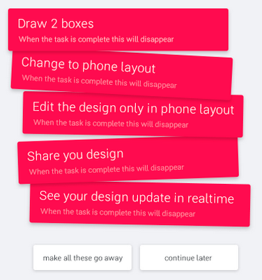

# Feature Discoverer

API service supporting an interactive guide that can help a user explore an application.

## How to Run

Just start with:

	# Set password used in API requests
	export FEATUREDISCOVERER_PASSWORD=MYPASSWORD

	grunt

Server will default to **http://localhost:3003**

## API

### Tasks that the user should accomplish

List tasks:

	curl http://localhost:3004/api/tasks?user=USERID

Create new task:

	curl -X POST -H "Content-Type: application/json" -d '{ "name": "my_task", "redirectUrl": "http://www.google.com" }' http://localhost:3004/api/tasks?password=MYPASSWORD

Update task:

	curl -X PUT -H "Content-Type: application/json" -d '{ "name": "my_new_task", "redirectUrl": "https://duckduckgo.com" }' http://localhost:3004/api/tasks/548cbb2b1ad50708212193d8?password=MYPASSWORD

Delete task:

	curl -X DELETE http://localhost:3004/api/tasks/5477a6f88906b9fc766c843e?password=MYPASSWORD

Delete all tasks:

	curl -X DELETE http://localhost:3004/api/tasks/ALL?password=MYPASSWORD

### Actions that the user had made

	curl -X POST -H "Content-Type: application/json" -d '{ "name": "Draw box" }' http://localhost:3004/api/actions?user=USERID

## Implementation

Based on the [Yeoman Express generator](https://github.com/petecoop/generator-express) with the "MVC" option.
Built on Node.js, Express (with EJS) and MongoDB.

## Deploying on Heroku

	# Set up and configure app
	heroku create MYAPPNAME
	heroku addons:add mongolab
	heroku config:set NODE_ENV=production

	# Set password used in API requests
	heroku config:set FEATUREDISCOVERER_PASSWORD=MYPASSWORD